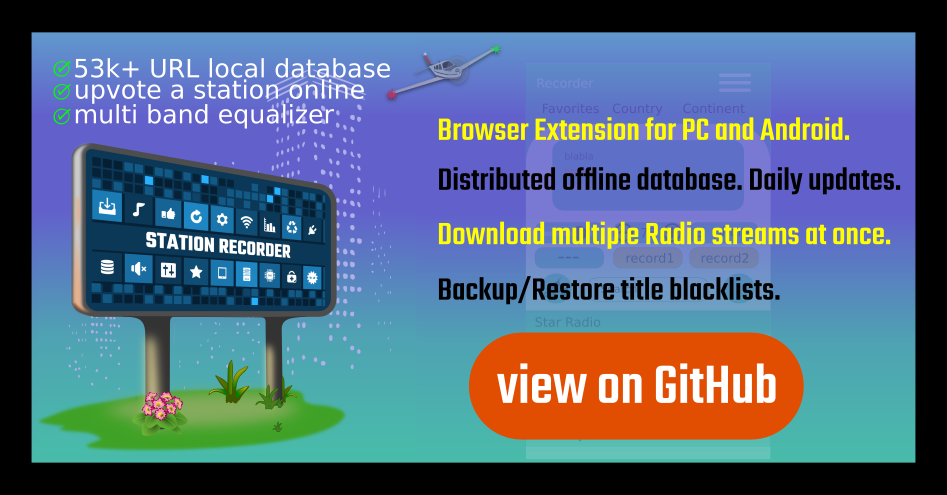

station-recorder - distributed frontend database
==================================================

Overview
---------
| This repository shows the source code of a NoSQL database "Browser extension". 

* Multi-stream downloads and play Radio/TV from "offline" URL DB
* Backup/Restore of Settings and Blacklists via JSON file
* Database update from compressed DB Backup of https://www.radio-browser.info/ 
* Audio multi-band equalizer with three bandwidth selecors

| JavaScript ES modules. ".mjs" (fix) named JS files for webWorker modules.
| The app takes the the datasets of the radio-browser.info MariaDB database and stores it inside
| the browsers *indexed DB* for offline use. 
| Updates can be pulled regularly from the public DB's backup archive by a button press.
|
| Datasets are customized and loaded into the RAM of the user's device for quick access.
| The dataset dictionaries are also used by features for inter-thread commuciation.
| 
| Features, like voting for a station and downloading streams, are added to improve the 
| user experience. 
| 
| The extension app can be used with FireFox on mobile Android devices and PC.
| 
| FireFox Android/PC Add-on: https://addons.mozilla.org/en-US/firefox/addon/station-recorder-extra-stark/
|
| It needs a feature upgrade to be also an npm package via express server to support 
| all browsers out of the box. See my ''PROKIF'' project as an example.

Help
-----
The help and documentation web page vor the latest release is located online and in the 
/docs folder of the repo.

It needs improvements for code documentation and project overview, as well as technical
documentaton. This is ongoing work.

ReadTheDocs (Python, work on): https://station-recorder.readthedocs.io/en/latest/README.html

Pictures
--------

.. raw:: html

    <embed>
        <table style="width:100%">
            <tr>
                <th>
                    </img>
                </th>
                <th>
                    </img>
                </th>
            </tr>

            <tr>
                <th>
                    </img>
                </th>
                <th>
                    </img>
                </th>
            </tr>

            <tr>
                <th>
                    </img>
                </th>
                <th>
                    </img>
                </th>
            </tr>

            <tr>
                <th>
                    </img>
                </th>
                <th>
                    </img>
                </th>
            </tr>

            <tr>
                <th>
                    </img>
                </th>
                <th>
                    
                </th>
            </tr>
        </table>    

    </embed>

  
Why
---

| My Python based ``Eisenradio`` idea (on top of GhettoRecorder) should be brought to
| a broader audience. The app's Python backend database will be now a JS frontend database.
| 
| To push things furter, I want to use the largest Radio/TV station stream database available.
| I distribute this large public DB to an app users indexedDB in the browser. 
| My intention was to keep things running in case of A general server shut down.
|
| Public DB https://www.radio-browser.info/, 
| and the repository at https://gitlab.com/radiobrowser, please. 
|
| The database is public available worldwide and also hosts TV station URLs. 
| radio-browser.info is fault tolerant. It has three replicating DB server online, 
| most of the time.
| 
| Additional app features, like voting and click counter display, as well as 
| stream recording shall improve the value of the app.
| 
| The local copy of the database is hosted in memory and allows super fast search  
| over radio names and genres (tags). 
|
| I added country and continent filters, because I am convinced, 
| that most people are interested in a more 'local area' search.

Browser Add-on Android/PC
--------------------------
Use the FireFox Add-on manager to locate ``station-recorder``. 

Uninstall Browser Add-on
------------------------
Remove the Add-on. ``All downloaded data are lost then``.

How it works
-------------
The Browser extension has an outdated copy of the radio-browser.info 
public database onboard and can be updated online.

The local JSON file is loaded at first run. The JSON indexed DB blob 
is loaded instead if an update was received.
Updates are allowed on a dayly basis to prevent overloading the public 
radio-browser database.

PC user can hit F12 to visit their data (FireFox 'web storage').

All data are permanently stored in the browser's IndexedDB (IDB). 
Until deinstallation. 

User setting are stored also in the IDB to survive HTML page reloads 
and browser closings.

Download feature allows to cut snippets from a station data stream and 
store them as blob in the indexed DB.
The title information of the station is stored in a blacklist IDB store 
to prevent unnessecary repeated downloads.
File blobs can be downloaded separated by station name if the next title 
was send by the station (stram cut). 

Blacklist dump allows to save all stored blacklists, as well as the 
user settings as a backup via JSON file.

The app uses a random public DB server as the session server to communicate. 
Click and vote feature sends user selected station ID to the public database. 
The app pulls every few minutes the latest dataset from the public DB API, 
for all openend station container. A badge shows the current vote and click 
counts for the station and the trend towards positive or negative numbers.

HowTo Android - install on FireFox
-----------------------------------
| 1. open Hamburger Menu
| 2. Select the puzzle icon, extensions
| 3. Scroll to the bottom and select "Find more extensions"
| 4. type the extension name and install

HowTo Android - Test extension
-------------------------------
| (A) Clone a branch from GitHub repo (SSH example). Use the exact branch name.
| 
|     foobar:~$ git clone -b station-recorder_1.0.0  --single-branch git@github.com:44xtc44/station-recorder.git
|     foobar:~$ cd station-recorder_1.0.0
| 
| (B) Install node.js. 
| 
| (C) Install 'web-ext' "https://extensionworkshop.com/documentation/develop/developing-extensions-for-firefox-for-android/".
| 
| (D) Install Android Studio latest and create a "dummy project" to get Android Studio device manager.
| The device manager is needed to run a Android Virtual Device (AVD).
| You can also use a Phone directly. But be aware that you might need to reset it 
| to factory defaults on a "catastrophic" failure. I had to do this during another project.
| 
| (E) You then want to download the FireFox browser apk file and drag it onto the AVD. 
| Search "Firefox Nightly for Developers". If you find 'APKmirror' save, go there. 
| Else use the registration process to enable PlayStore to pull FireFox Nightly, into every AVD.
| 
| (F) Open a terminal in the root of the repo/branch clone, to load the Add-on into the AVD via USB.
| 
|     @lab42$ adb devices -l
|     List of devices attached
|     emulator-5554   offline
| 
|     @lab42$ web-ext run --target=firefox-android --android-device emulator-5554 --firefox-apk org.mozilla.fenix
| 
| The AVD and FireFox Nightly must be USB enabled (Dev mode) then.
| 
| Please be patient and wait until the extension popup notification appears on the device. 

Known issues
-------------

Recorded AAC files stuck (incomplete first/last frame)
^^^^^^^^^^^^^^^^^^^^^^^^^^^^^^^^^^^^^^^^^^^^^^^^^^^^^^
There is currently no aac file frame cleaner/cutter implemented.
Playing multiple recorded aac files in a browser can lead to playing silently aborted.
You can fix your files with my "aac-repair" npm package.

Long running records
^^^^^^^^^^^^^^^^^^^^^^
Abort long running records will lead to not disappearing the associated 
HTML grid station name below the search input.

Bandwith
^^^^^^^^^^
A limited WLAN connection and many running downloads 
lead to dropped fetch requests. Threats die quiet.
Needs a wathchdog threat to write at least a message.
There is no thread kill mechanism in the JS interpreter available.

Libraries
-------------

| Shaka for ".m3u8" file type. That is HLS (HTTP Live Streaming TV/Radio). 
| Apache-2.0 license and file in the "/static/js/assets" folder.
| https://github.com/shaka-project/shaka-player?tab=Apache-2.0-1-ov-file#readme
|
| JSZip for one click "FireFox for Android" multi-file to user's /Downloads folder.
| Uses GPLv3.

Contributions
-------------

Pull requests are welcome.
If you want to make a major change, open an issue first to have a short discuss.

Thank you
----------
For making the database pupblic avilable. https://gitlab.com/radiobrowser

License
-------
GPLv3